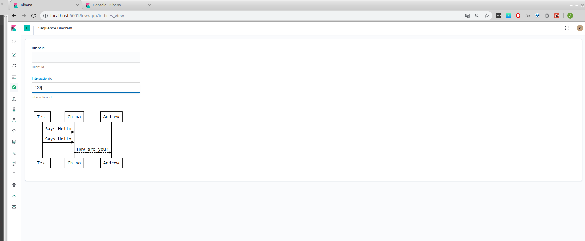

# Просмотр логов как Sequence Diagram

Плагин для Kibana 7.3.0 для просмотра логов в виде Sequence Diagram


## Screenshots



# Настройка среды

## Клонирование исходного кода Kibana и установка зависимостей

Вначале необходимо сделать форк или клонировать репозиторий Kibana:
При этом репозиторий необходимо клонировать именно в папку с именем kibana,
а не с каким-то другим именем.

Клонировать репозиторий (если вы ранее сделали fork) можно следующей командой:

git clone https://github.com/[YOUR_USERNAME]/kibana.git kibana

Затем следует прейти в каталог kibana:

```cd kibana```

и выполнить checkout на нужную версию (в данном случа 7.3)

Затем необходимо установить версию Node.Js, указанную в файле 
.node-version расположенном в корневой директории проекта с исходным кодом Kibana.

Это можно сделать при помощи таких инструментов как 
nvm, nvm-windows или avn

Поскольку в исходниках также есть файл .nvmrc
вы можете переключиться на правильную версию
при использовании nvm,
выполнив следующую команду:

```nvm use```

Далее вам необходимо установить последнюю версию yarn.


Затем загрузите Kibana и установите все зависимости:
```yarn kbn bootstrap```

в конце в консоли должно появиться сообщение вида:
```	Bootstrapping completed!```

Если что-то пошло не так можно удалить зависимости:

```
yarn kbn clean
```

## Клонирование исходного кода плагина

Плагин следует склонировать в директорию с исходным кодом Kibana 
в поддиректорию ```plugins```

Имя директории обязательно должно совпадать с именем плагина,
в данном случае ```indices_view``` 

В корневой директории плагина следует выполнить
```
yarn install
```

## Запуск Elasticsearch локально

Существует несколько вариантов локального запуска Elasticsearch

### Запуск из Nightly snapshot

Эти снапшоты создаются ночью,
и срок их действия составляет обычно через несколько недель.
При запуске из старой неотслеживаемой ветви git,
соответствующий ей снапшот может не существовать.

В этом случае вам может потребовать запустить Elasticsearch
из исходных кодов или скачав соответствующий архив.

Запуск из снапшота выглядит так:
```
yarn es snapshot
```

### Запуск из исходных кодов

По умолчанию, он ссылается на elasticsearch checkout (исходные коды elasticsearch)
которые обязательно должны находиться в каталоге с именем elasticsearch
и этот каталог elasticsearch должен находиться в одном каталоге с каталогом исходных кодов Kibana (kibana каталог)

Если вы хотите разместить исходники Elasticseach в другом месте,
то можно задать это место при помощи следующего ключа: --source-path

Запуск elasticsearch из исходников выполняется такой командой выполняемой из папки с исходниками kibana:

```yarn es source```


## Запуск Kibana

После запуска эластика, необходимо запустить kibana

``` 
yarn start
```

при этом может возникнуть ошибка 
``` server   error  [09:23:03.219] [warning][stats-collection] [index_not_found_exception] no such index [.kibana]```

эту ошибку можно проигнорировать.
Вот более подробное описание: 
	https://github.com/floragunncom/search-guard-kibana-plugin/issues/66
	
Сервер запустится и будет доступен по адресу: 
```
http://localhost:5601
```
	
Логин и пароль для входа в веб-интерфейс Kibana:
```
	login: elastic
	password: changeme
```

Несмотря на то что в логе есть сообщения вида
	server    log   [09:23:10.730] [info][listening] Server running at http://localhost:5603/meq
тем ни менее Kibana будет доступна именно на порту 5601
```				
	http://localhost:5601
```
		